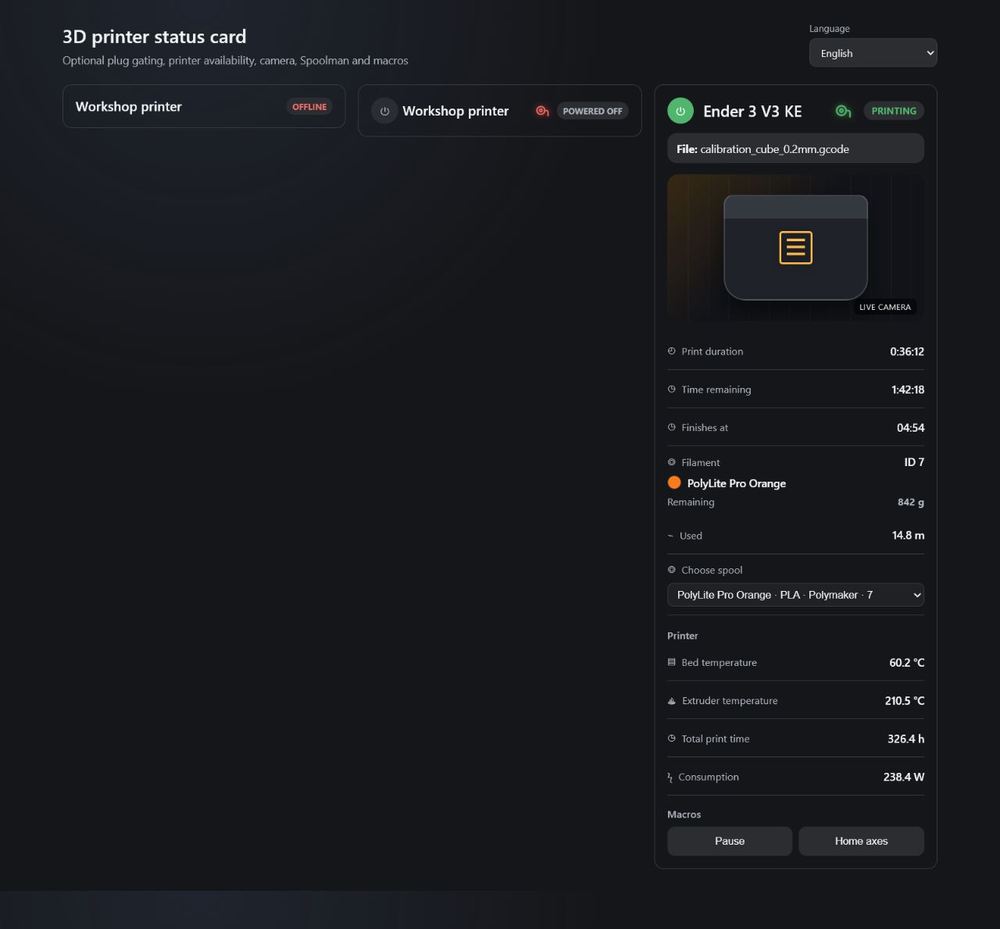

# 3D printer status card

A configurable Home Assistant Lovelace card for monitoring and controlling a 3D printer. It works with ordinary Home Assistant entities, so it can be used with Moonraker/Klipper, OctoPrint, or another printer integration that exposes equivalent sensors and controls.



## Features

- Compact offline and powered-off views
- Optional smart plug or breaker switch with a power button
- Optional current-consumption check that detects a physically disconnected printer
- Optional printer status entity used as an online health check
- Camera with `live` or `auto` view
- Calculated local print completion time derived from the remaining-time entity
- Print duration, remaining time, completion time, and used filament shown only while printing or paused
- Temperatures, filename, total print time, and current consumption
- Optional dashboard-style filament indicator in the card header, with configurable sensor states and a localized hover tooltip
- Optional Spoolman information and active-spool selection through a Home Assistant service
- Entity and service macros
- Complete visual configuration editor, including Spoolman and macros
- Manual localization: English, Русский, Українська
- Sections-view grid support

Every integration beyond the basic card is optional. A smart plug, camera, Spoolman, filament sensor, spool-selection service, and macros can be omitted independently.

## Printer compatibility

The card can display any printer integration that exposes equivalent Home Assistant entities. Its complete Spoolman workflow, including changing the active spool, is designed for printers that run Moonraker or devices on which Moonraker can be installed. OctoPrint and other integrations remain supported for ordinary status, metric, camera, power, filament-sensor, and macro entities.

## Installation

### HACS (recommended)

1. Open HACS.
2. Open the three-dot menu and choose **Custom repositories**.
3. Add `https://github.com/TheGarmr/3d-printer-status-card` as a **Dashboard** repository.
4. Install **3D printer status card**.
5. Reload Home Assistant in the browser.

HACS registers `printer-status-card.js` as a Lovelace resource automatically.

### Manual installation

1. Copy `dist/printer-status-card.js` to `config/www/printer-status-card.js` on your Home Assistant instance.
2. Open **Settings → Dashboards → Resources**.
3. Add `/local/printer-status-card.js` as a **JavaScript module**.
4. Reload the browser.

## Visual configuration

Add a card to a dashboard and search for **3D printer status card**. The visual editor provides sections for:

- general settings and manual language selection;
- printer entities;
- optional plug, breaker, and current consumption;
- filament states;
- Spoolman entities, templates, and active-spool service;
- an ordered list of entity and service macros.

Changes are reflected in the Home Assistant card preview immediately. YAML remains available for advanced editing and is fully compatible with the visual editor.

## YAML example

```yaml
type: custom:printer-status-card
name: Ender 3 V3 KE
language: en                    # en | ru | uk
show_camera: true
camera_view: live              # live | auto

filament_present_state: "on"
filament_missing_state: "off"

entities:
  # Optional online health check. It is also required to identify an active print job.
  status: sensor.printer_current_print_state

  # Also used to calculate the localized local completion time.
  remaining_time: sensor.printer_print_time_left
  elapsed_time: sensor.printer_print_duration
  filament_used: sensor.printer_filament_used
  bed_temp: sensor.printer_bed_temperature
  extruder_temp: sensor.printer_extruder_temperature
  total_print_time: sensor.printer_total_print_time
  filament_present: binary_sensor.printer_filament_sensor
  filename: sensor.printer_filename
  camera: camera.printer_webcam

  # Optional plug or breaker checks.
  power_switch: switch.printer_plug
  power_now: sensor.printer_plug_power

  # Optional Spoolman entities.
  spool_id: sensor.printer_spool_id

spoolman:
  set_active_spool_service: rest_command.set_spool_id
  get_active_spool_service: rest_command.get_active_spool_id
  spool_entity_template: sensor.spoolman_spool_{id}
  filament_name_entity_template: sensor.spoolman_spool_{id}_filament_name
  filament_material_entity_template: sensor.spoolman_spool_{id}_filament_material
  vendor_name_entity_template: sensor.spoolman_spool_{id}_vendor_name
  color_hex_entity_template: sensor.spoolman_spool_{id}_color_hex
  id_entity_template: sensor.spoolman_spool_{id}_id

macros:
  - name: Pause
    entity: button.printer_pause_print

  - name: Resume
    entity: button.printer_resume_print

  - name: Home axes
    service: rest_command.printer_gcode
    service_data:
      script: G28

  - name: Cooldown
    service: rest_command.printer_gcode
    service_data:
      script: TURN_OFF_HEATERS
```

The same example is available as [`printer-status-card.yaml`](printer-status-card.yaml).

## Compact, offline, and expanded states

The three check entities are optional:

- `entities.power_switch` — a smart plug, relay, breaker, or equivalent switch;
- `entities.power_now` — the plug's current power-consumption sensor;
- `entities.status` — a printer integration status entity and online health check.

An omitted check passes automatically. Configured checks are evaluated in this order:

1. A missing, `unknown`, `unavailable`, `none`, `null`, or `offline` power switch produces compact **OFFLINE** mode.
2. A power switch whose state is not `on` produces compact **POWERED OFF** mode.
3. Missing, invalid, or offline power consumption produces compact **OFFLINE** mode.
4. Numeric power consumption less than or equal to zero produces compact **POWERED OFF** mode. This covers a printer cable that has been physically disconnected while the plug remains on.
5. A configured printer status that is missing, `unknown`, `unavailable`, `none`, `null`, or `offline` produces compact **OFFLINE** mode.
6. When every configured check passes, the full card is expanded.

| Plug switch | Consumption | Printer status | Result |
|---|---:|---|---|
| `off` | any | any | Compact · POWERED OFF |
| `on` | `0` or less | any | Compact · POWERED OFF |
| `on` | greater than `0` | available | Expanded |
| offline or missing | any | any | Compact · OFFLINE |
| `on` | offline or invalid | any | Compact · OFFLINE |
| `on` | greater than `0` | offline or missing | Compact · OFFLINE |
| omitted | omitted | offline or missing | Compact · OFFLINE |
| omitted | omitted | omitted | Expanded |

Compact mode displays only the optional power button, card name, and status badge. Camera, metrics, Spoolman, spool selection, and macros are hidden.

## Configuration reference

### General options

| Option | Default | Description |
|---|---|---|
| `type` | required | Must be `custom:printer-status-card` |
| `name` | `3D Printer` | Card title |
| `language` | `en` | Manual card language: `en`, `ru`, or `uk` |
| `show_camera` | `true` | Show the configured camera in expanded mode |
| `camera_view` | `live` | Home Assistant camera mode: `live` or `auto` |
| `filament_present_state` | `on` | Raw filament-sensor state interpreted as present |
| `filament_missing_state` | `off` | Raw filament-sensor state interpreted as missing |
| `entities` | `{}` | Entity mapping described below |
| `spoolman` | built-in templates | Spoolman entity templates and optional selection service described below |
| `macros` | `[]` | Ordered entity or service actions |

The card does not auto-detect language. English is always used unless `language: ru` or `language: uk` is selected explicitly.

### Entity mapping

All entity fields are optional.

| Entity key | Purpose |
|---|---|
| `status` | Printer integration state, optional online check, and active-print detector |
| `remaining_time` | Estimated time remaining and calculated completion time |
| `elapsed_time` | Current print duration |
| `filament_used` | Filament consumed by the current job |
| `bed_temp` | Bed temperature |
| `extruder_temp` | Extruder temperature |
| `total_print_time` | Lifetime print time |
| `filament_present` | Filament presence sensor shown as a green/red spool icon in the card header |
| `filename` | Current file name |
| `camera` | Home Assistant camera entity |
| `power_switch` | Smart plug, relay, or breaker switch |
| `power_now` | Current power-consumption sensor |
| `spool_id` | Sensor containing the active Spoolman spool ID |

Missing ordinary metric entities hide only their own rows. Missing configured `status`, `power_switch`, or `power_now` entities affect the card mode because they are availability checks.

Completion time, print duration, remaining time, and used filament appear only when the configured `status` entity is `printing`, `busy`, `paused`, or `pause` (case-insensitive). They are hidden for every other state and when `status` is omitted.

When `filament_present` matches `filament_present_state`, the header shows a glowing green spool icon. A match with `filament_missing_state` shows the same icon in red. Hovering the icon displays a localized explanation, and clicking it opens the sensor's Home Assistant more-info dialog. Missing, unavailable, or unrecognized sensor states hide the indicator.

During an active or paused print, when `remaining_time` contains `HH:MM:SS`, `MM:SS`, or a numeric duration with seconds, minutes, or hours as its unit, the card also calculates the local completion time. Today shows only the time, tomorrow uses a localized “Tomorrow, at …” phrase, and later completions show a localized date and time. Invalid or non-positive durations hide only the calculated row.

### Spoolman configuration

`{id}` is replaced with the numeric ID read from `entities.spool_id`.

| Option | Default | Purpose |
|---|---|---|
| `set_active_spool_service` | empty | Home Assistant service called when a spool is selected, for example `rest_command.set_spool_id` |
| `get_active_spool_service` | empty | Optional response-returning service used to verify the active spool, for example `rest_command.get_active_spool_id` |
| `spool_entity_template` | `sensor.spoolman_spool_{id}` | Main spool entity used for attributes and remaining amount |
| `filament_name_entity_template` | `sensor.spoolman_spool_{id}_filament_name` | Filament name |
| `filament_material_entity_template` | `sensor.spoolman_spool_{id}_filament_material` | Material shown in the selector |
| `vendor_name_entity_template` | `sensor.spoolman_spool_{id}_vendor_name` | Manufacturer shown in the selector |
| `color_hex_entity_template` | `sensor.spoolman_spool_{id}_color_hex` | Current-filament color |
| `id_entity_template` | `sensor.spoolman_spool_{id}_id` | Discovery source; its state supplies the numeric spool ID |

The main spool entity can provide remaining weight or length as its state or attributes. Filament name, material, vendor, and color use their dedicated entities first and then fall back to common Spoolman attributes.

The selection list is built automatically from available entities matching `id_entity_template`, such as `sensor.spoolman_spool_18_id`. The numeric spool ID is read from the entity state; both ordinary Home Assistant string states and exported `raw`/`translated` state objects are supported. Archived and unavailable spools are omitted.

Each option is displayed as `Name · Material · Manufacturer · 18`. The ID has no prefix and remains visible at the end even when a long label is shortened to fit the card. While selection and optional verification are running, the list is temporarily disabled and shows a progress indicator. If `set_active_spool_service` is empty or invalid, filament information remains available but the selection list is hidden.

### Moonraker active-spool setup

Moonraker owns the active Spoolman spool and exposes it through `/server/spoolman/spool_id`. Add the following commands to `configuration.yaml`, or place their contents in the file included by your existing `rest_command` configuration. Replace `<MOONRAKER_HOST>` and `<SPOOLMAN_HOST>` with addresses reachable from Home Assistant.

```yaml
rest_command:
  set_spool_id:
    url: "http://<MOONRAKER_HOST>:7125/server/spoolman/spool_id"
    method: POST
    headers:
      accept: "application/json, text/html"
      user-agent: 'Mozilla/5.0 {{ useragent | default("Home Assistant") }}'
    payload: '{"spool_id": {{ spool_id }}}'
    content_type: "application/json; charset=utf-8"
    verify_ssl: false

  get_active_spool_id:
    url: "http://<MOONRAKER_HOST>:7125/server/spoolman/spool_id"
    method: GET
    headers:
      accept: "application/json, text/html"
      user-agent: 'Mozilla/5.0 {{ useragent | default("Home Assistant") }}'
    content_type: "application/json; charset=utf-8"
    verify_ssl: false

  get_spool_info:
    url: "http://<SPOOLMAN_HOST>:7912/api/v1/spool/{{ spool_id }}"
    method: GET
    content_type: "application/json"
```

The card calls `rest_command.set_spool_id`, passing numeric `spool_id` and `useragent`. Configure it as `spoolman.set_active_spool_service`.

For verified selection, configure `rest_command.get_active_spool_id` as `spoolman.get_active_spool_service`. After setting a spool, the card requests this action through Home Assistant with `return_response: true`, reads `content.spool_id`, and displays the ID confirmed by Moonraker. A failed or malformed verification rolls the card back to `entities.spool_id`. When the verification service is omitted, selection remains backward-compatible and waits for that entity to catch up.

`get_spool_info` remains an optional helper for automations and troubleshooting.

`entities.spool_id` must point to a Home Assistant entity that stays synchronized with Moonraker's active spool ID. The REST commands above do not create that entity by themselves; use the entity exposed by your printer integration, a REST sensor, or an automation that refreshes the value. The selector and filament block show the pending or Moonraker-confirmed spool immediately, then reconcile with this entity when it catches up.

Moonraker's official API documentation: [Spoolman integration endpoints](https://moonraker.readthedocs.io/en/latest/external_api/integrations/#spoolman-apis).

### Macros

An entity macro contains `name` and `entity`. Button entities are pressed, script entities are turned on, and other domains receive `turn_on`.

```yaml
- name: Pause
  entity: button.printer_pause_print
```

A service macro contains `name`, `service`, and optional `service_data` and `target` objects.

```yaml
- name: Home axes
  service: rest_command.printer_gcode
  service_data:
    script: G28
  target: {}
```

The visual editor validates `service_data` and `target` as JSON objects before updating the card configuration.

## Localization

The selected language applies to both the card and visual editor:

- `en` — English, default;
- `ru` — Русский;
- `uk` — Українська.

Home Assistant still formats entity states and units. Missing card translations fall back to English.

## Development

Requires Node.js 22.18 or newer.

```bash
npm install
npm run check
```

Useful commands:

```bash
npm run typecheck     # strict TypeScript validation
npm test              # unit tests
npm run build         # bundle + standalone preview
```

Build artifacts:

- `dist/printer-status-card.js` — Home Assistant/HACS resource;
- `dist/preview.html` — standalone preview with mocked Home Assistant state and a manual language selector.

## License

[MIT](LICENSE) © 2026 TheGarmr
